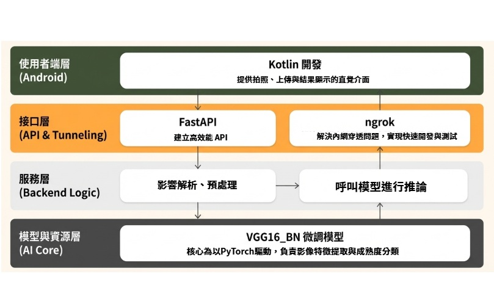

## 果然會辨識 - CNN訓練水果成熟度判斷
`# CNN - VGG16_BN` `# kotlin` `# ngrok`

## 系統簡介
果然會辨識系統是一套以`影像辨識技術`為核心的`水果成熟度分析系統`，
使用者僅需透過手機拍攝水果照片，即可即時獲得水果成熟度判斷結果，
協助消費者降低購買不確定性，也為生產與銷售端提供更客觀的分級依據。

本系統旨在解決傳統水果成熟度判斷過度仰賴經驗與主觀視覺的問題，
透過人工智慧模型，將原本難以量化的判斷過程轉化為可重現、可擴充的分析流程。

## 展示畫面

```
一鍵即可得知結果
```

## 系統架構



## 成效
- 提高消費者購買意願
- 水果供應商產品分級
- 準確度93%
